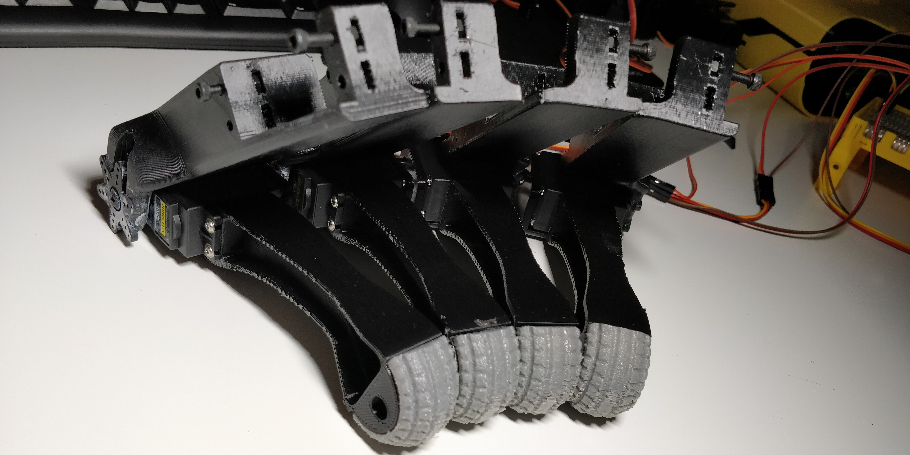
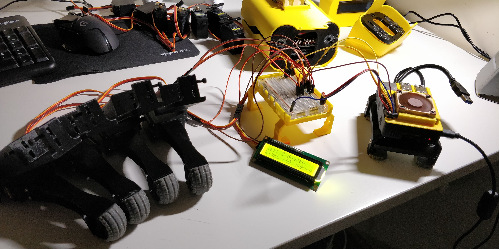

Remember to align your servos before mounting.
Also to test them before you mount, in case some are presenting excessive jitter.

To thest them use the script align_mounted_servos.py in this folder.

Some videos to give you an idea of what I did:

**SpotMicro - Jittering servo, need a replacement**

**SpotMicro - Aligning servos 1**

**SpotMicro - Aligning servos 2**

**SpotMicro - Aligning servos 3**

