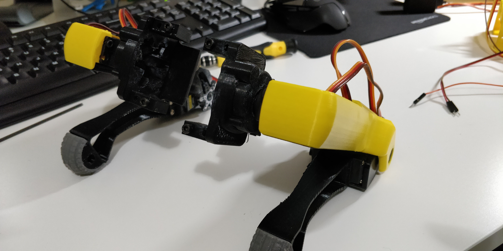

Remember to align your servos before mounting.
Also to test them before you mount, in case some are presenting excessive jitter.

To thest them use the script align_mounted_servos.py in this folder.

Make sure you have the I2C interface connected in raspberry, in the Interfacing Options
```
sudo raspi-config
```

```
ssh pi@192.168.1.XX

cd "projects/electronics/Align your servos/script"

sudo apt-get install python3-venv -y
python3 -m venv venv --clear
source venv/bin/activate

curl https://bootstrap.pypa.io/get-pip.py | python

pip install --upgrade pip
pip install --upgrade setuptools
python3 -m pip install smbus
python3 -m pip install RPi.GPIO

python3 align_mounted_servos.py
```




For me the trick was:
* lower part of the leg: max 90º and 180º and adjust them as in the picture (different angles since right or left are the opposite)
* Mind servos, 90º, then center the horns and mount
* Shoulder servos 90º, then center the horns and mount

Some videos to give you an idea of what I did:

**SpotMicro - Jittering servo, need a replacement**

[](http://www.youtube.com/watch?v=7d3iO5jCroM "")

**SpotMicro - Aligning servos 1**

[](http://www.youtube.com/watch?v=tBt8xCcZeH0 "")

**SpotMicro - Aligning servos 2**

[](http://www.youtube.com/watch?v=m_V5X4ZloSo "")

**SpotMicro - Aligning servos 3**

[](http://www.youtube.com/watch?v=I0enRPsiIeQ "")
